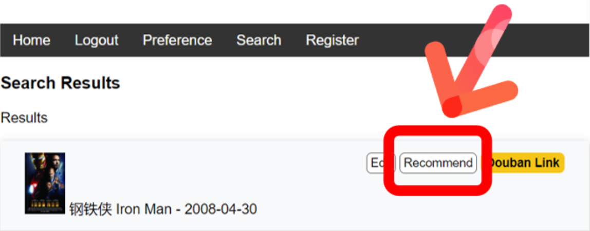
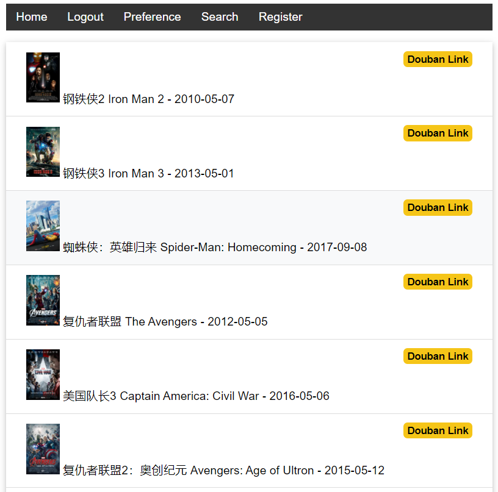
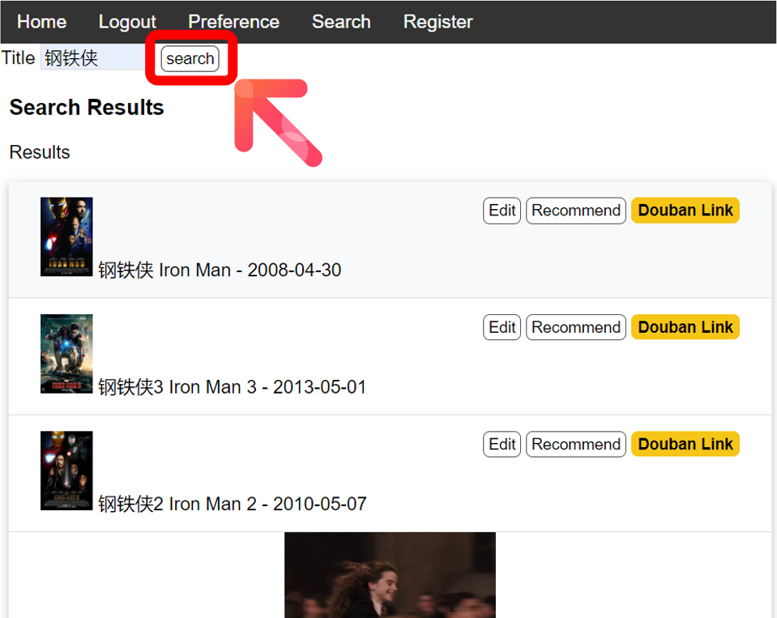
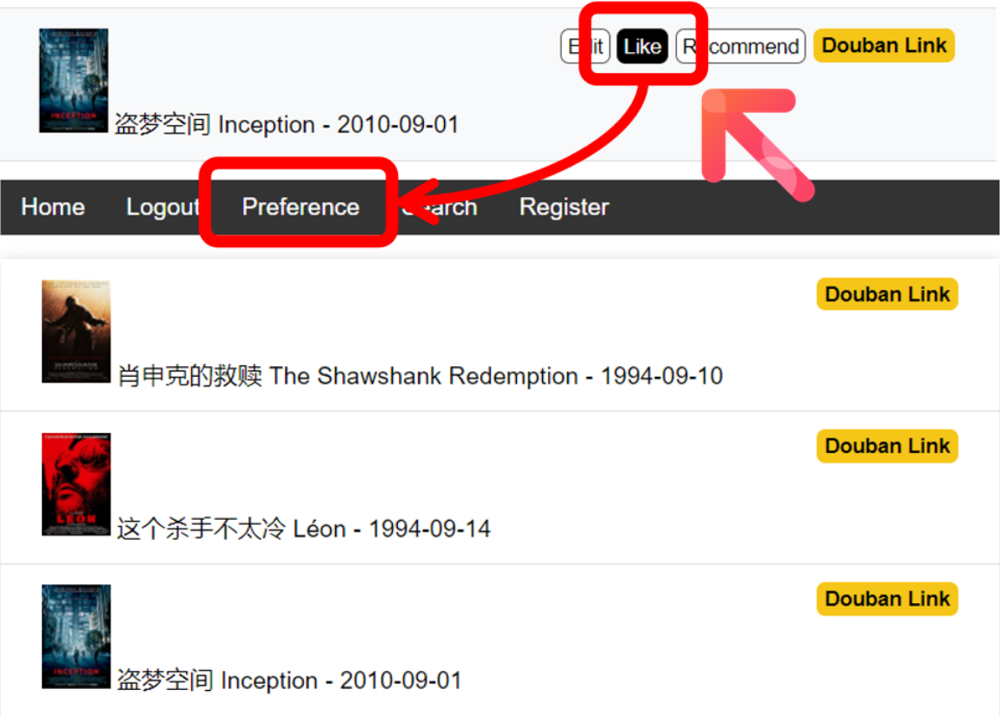

# 简易版仿豆瓣影视推荐系统
## 链接地址 http://gogogoaquarius.pythonanywhere.com/

### 登录和注册

数据库不直接存储用户名和密码，改用hashcode存储。

### 推荐功能

Jieba分词将每部影片的简介分解为关键词，TF-IDFVectorizer 加 cosine_similarity计算每两部影片之间的相似度。最终的结果只取与某部影片最相似的前十部电影。

### 搜索

在数据库中利用SQL的全文本搜索

### 偏好

用户可以通过like按钮维护自己所喜爱的电影列表，主要用于记录行为记录以及为每个用户生成个性化的推荐

### 编辑电影条目

更改电影的名称，日期/也可以通过上传提交新增影片

### 本地运行

git clone

pip install -r requirements.txt

flask run